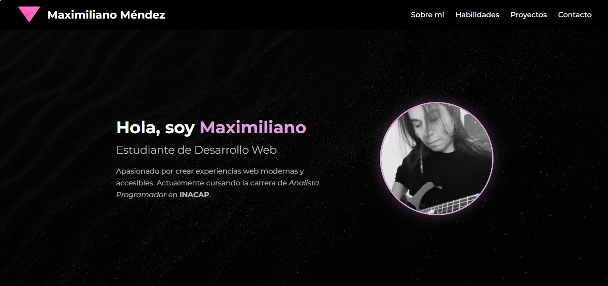
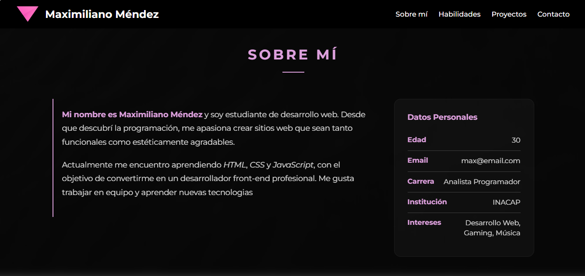
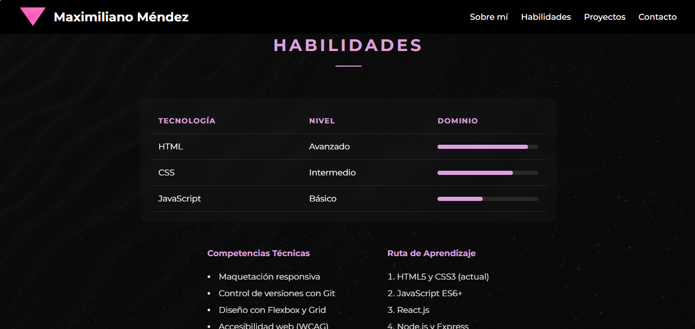
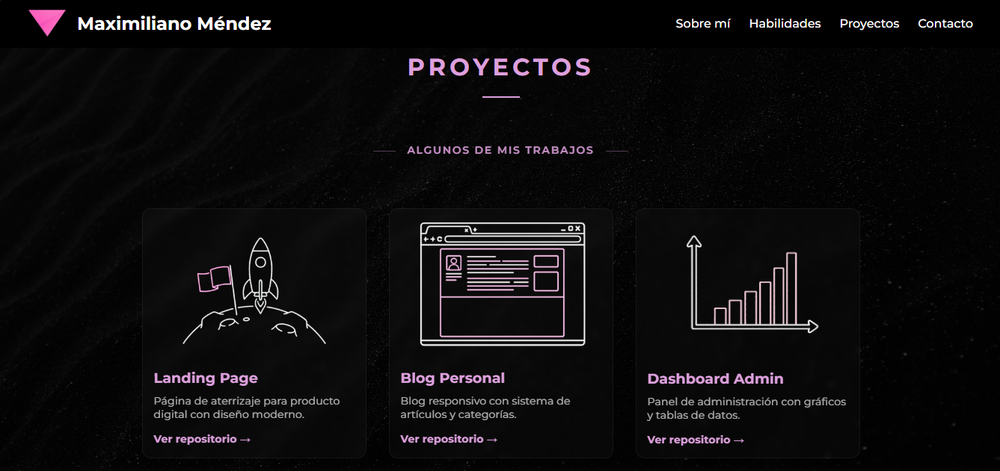
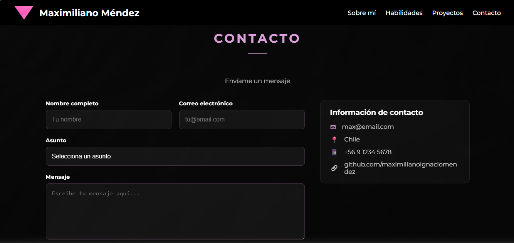

# Portafolio Profesional - Maximiliano Méndez

Este proyecto es un portafolio web personal desarrollado como parte de un trabajo académico para la carrera de **Analista Programador**. El objetivo es demostrar habilidades en desarrollo frontend, diseño responsivo y estructuración de proyectos web.

## Vista Previa
Puedes ver la versión en vivo de este proyecto a través de GitHub Pages en el siguiente enlace:
*[https://github.com/maximilianoignaciomendez/Proyecto-prueba]*

## Tecnologías Utilizadas
* **HTML5:** Estructura semántica del sitio.
* **CSS3:** Estilos personalizados, Flexbox para el layout y Media Queries para el diseño responsive.
* **Font Awesome:** Librería de iconos para redes sociales y secciones de contacto.
* **Google Fonts:** Tipografías personalizadas (Montserrat).

## Características
* **Diseño Responsive:** Adaptado para dispositivos móviles, tablets y escritorio.
* **Navegación Fluida:** Menú con `scroll-behavior: smooth` para una mejor experiencia de usuario.
* **Sección de Proyectos:** Galería visual con efectos de hover.
* **Formulario de Contacto:** Diseño moderno con validación de campos básica y tarjeta de información lateral.
* **Paleta de Colores:** Basada en tonos oscuros con acentos en color `plum` y rosa, manteniendo una estética moderna y limpia.

## Estructura del Proyecto
```text
/
├── index.html          # Archivo principal de la web
├── estilos.css        # Hoja de estilos principal
├── logo.png           # Logo personal
├── fondo.jpg          # Imagen de fondo del hero
└── README.md          # Documentación del proyecto
```

## Vista Previa del Proyecto




